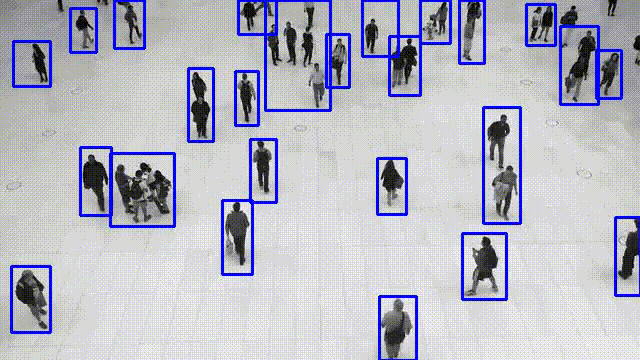

# Motion Detection in Video Files
This Python project detects motion in video files by comparing frames to a background model. The project uses OpenCV and NumPy libraries for video processing and numerical computations. The detected motion is highlighted by drawing bounding rectangles around moving objects.

Requirements
- Python 3.x
- OpenCV (cv2)
